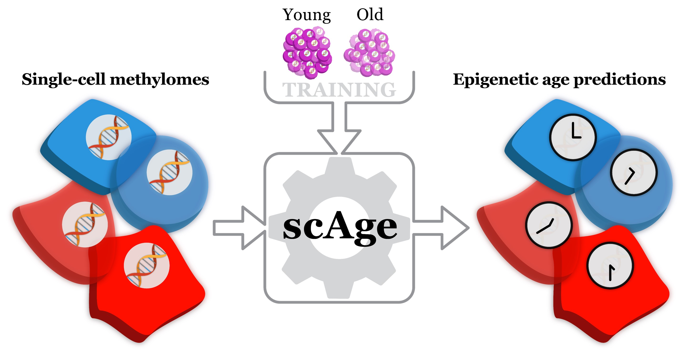

# scAge

[](https://github.com/alex-trapp/scAge/blob/main/LICENSE)
[](https://gladyshevlab.bwh.harvard.edu/)
[](https://www.python.org/)
[](https://twitter.com/AlexandreTrapp)


<b>scAge</b> is a framework for profiling epigenetic age at single-cell resolution, developed entirely in Python. <br> <br>
This tool, the first available single-cell clock, inherently leverages the relationship between DNA methylation in bulk samples and chronological age to predict
epigenetic age in intrinsically sparse and binarized single-cell data. <br> <br>
This computational platform is both highly scalable and deeply flexible.
It can be used on any number of cells, and may be trained on any methylation-age dataset. <br>

To learn more about <b>scAge</b>, please consult the [Trapp et al. preprint on bioRxiv](https://www.biorxiv.org/content/10.1101/2021.03.13.435247v1):

```
Profiling epigenetic age in single cells
Alexandre Trapp, Csaba Kerepesi & Vadim N. Gladyshev
bioRxiv 2021.03.13.435247
```

Remarkably, a modification of the <b>scAge</b> framework can also be applied to shallow methylation sequencing data, allowing for dramatic cost-effectiveness in regard to sequencing.
To learn more about this application to low-pass data, please consult the other [Trapp et al. preprint on bioRxiv](https://www.biorxiv.org/content/10.1101/2021.10.25.465778v1), as well as [Patrick Griffin's excellent TIME-Seq preprint](https://www.biorxiv.org/content/10.1101/2021.10.25.465725v1):

```
Cost-effective epigenetic age profiling in shallow methylation sequencing data
Alexandre Trapp & Vadim N. Gladyshev
bioRxiv 2021.10.25.465778
```

```
Ultra-cheap and scalable epigenetic age predictions with TIME-Seq
Patrick Griffin, Alice Kane, Alexandre Trapp, Jien Li, Maeve McNamara, Margarita Meer,
Michael MacArthur, Sarah Mitchell, Amber Mueller, Colleen Carmody, Daniel Vera,
Csaba Kerepesi, Nicole Noren Hooten, James Mitchell, Michele Evans, Vadim N. Gladyshev & David A. Sinclair
bioRxiv 2021.10.25.465725
```

To learn more about the rejuvenation event discussed in the manuscript, please consult the [Kerepesi et al. paper published in Science Advances](https://advances.sciencemag.org/content/7/26/eabg6082), which analyzes embryonic epigenetic dynamics at the bulk level:

```
Epigenetic clocks reveal a rejuvenation event during embryogenesis followed by aging
Csaba Kerepesi, Bohan Zhang, Sang-Goo Lee, Alexandre Trapp & Vadim N. Gladyshev
Science Advances 7(26), 10.1126/sciadv.abg6082

```

## Installation

A `pip` package version of the framework will be released shortly.

For now, to install scAge and associated data, please clone the GitHub repository:

`git clone https://github.com/alex-trapp/scAge.git`

This will download all required data to utilize and test the software. <br>

Warning: downloading the full repository will take up about ~620 MB of space on your disk.

For ease of use, all functions needed to run the full scAge pipeline are directly included within the `scAge.py` script.

## Usage

To run <b>scAge</b>, first add the directory containing `scAge.py` to your path, then import <b>scAge</b> into a Python script or Jupyter notebook:

```
import sys
sys.path.append('/path/to/dir') # where dir is a directory containing scAge.py
import scAge
```

In order to use the functions provided in <b>scAge</b>, the following packages need to be installed:

`numpy` (tested with version 1.20.2) <br>
`pandas` (tested with version 1.2.4) <br>
`scipy` (tested with version 1.6.3) <br>
`sklearn` (tested with version 0.24.2) <br>
`tqdm` (tested with version 4.60.0) <br>

This tool was developed in Python 3.9.2 in an Anaconda environment, running on Ubuntu 16.04.6 LTS.

To visualize epigenetic age predictions, installation of `seaborn`, `matplotlib` and `statannot` is also recommended.

Predicted epigenetic age output dataframes are conveniently written to .tsv files, and can therefore also be analyzed in any other environment (R, Excel, etc...).

## Example notebooks

A set of 3 example Jupyter notebooks detailing how to use the <b>scAge</b> tool are provided in the `notebooks` directory: <br>
* `process_coverage_notebook.ipynb` --> processing .cov/.cov.gz Bismark-generated files into filtered binary methylation matrices <br>
* `construct_reference_notebook.ipynb` --> constructing a reference set of linear models from a bulk methylation-age matrix <br>
* `run_scAge_notebook.ipynb` --> predicting epigenetic age in single cells, using binary single-cell matrices and a precomputed reference set <br>

These notebooks use all the murine single cells from the [Gravina et al. 2016 study](https://genomebiology.biomedcentral.com/articles/10.1186/s13059-016-1011-3),
described in depth in Figure 2 of our manuscript. This includes 11 hepatocytes from young livers (4-month-old), 10 hepatocytes from old livers (26-month-old), and 5 mouse embryonic fibroblasts (MEFs). Of note, two cells (one young fibroblast and one old fibroblast) show abberant clustering profiles using dimensionality reduction approaches ([see Figure 2c of their paper](https://genomebiology.biomedcentral.com/articles/10.1186/s13059-016-1011-3/figures/2)). These cells also have high predicted epigenetic ages. We suppose these cells may be senescent, but these results may also simply be due to technical artifacts.

All the required data to run these example scripts is provided in this repository:
* Single-cell methylation coverage files (.cov.gz) are located in `sc_data_raw`
* Processed binary methylation matrices (produced by running `process_coverage` on raw .cov.gz files) are located in `sc_data_processed`
* Bulk data for C56BL/6J liver samples used to construct sample reference models is located in `bulk`
* Processed reference matrices (produced by running `construct_reference` on bulk DNAm-age data) for liver, blood, muscle, and multi-tissue datasets are located in `train`

The functions driving **scAge** are documented in detail below:

## Data

All data from this study is publicly available from the [GEO database](https://www.ncbi.nlm.nih.gov/geo/) or the [SRA](https://www.ncbi.nlm.nih.gov/sra).

The table below summarize where the processed methylation data can be obtained:
Study | GEO Accession |
:---: | :---: |
[Angermueller et al. 2016](https://www.nature.com/articles/nmeth.3728) | [GSE68642](https://www.ncbi.nlm.nih.gov/geo/query/acc.cgi?acc=GSE68642) |
[Hernando-Herraez et al. 2019](https://www.nature.com/articles/s41467-019-12293-4) | [GSE121436](https://www.ncbi.nlm.nih.gov/geo/query/acc.cgi?acc=GSE121436) |
[Smallwood et al. 2014](https://www.nature.com/articles/nmeth.3035) | [GSE56879](https://www.ncbi.nlm.nih.gov/geo/query/acc.cgi?acc=GSE56879) |
[Argelaguet et al. 2019](https://www.nature.com/articles/s41586-019-1825-8) | [GSE121690](https://www.ncbi.nlm.nih.gov/geo/query/acc.cgi?acc=GSE121690) |

In the case of the [Gravina et al. 2016 study](https://genomebiology.biomedcentral.com/articles/10.1186/s13059-016-1011-3), no deposition of processed methylation data was made to GEO. I downloaded trimmed FASTQ files from the SRA (accession [SRA344045](https://www.ncbi.nlm.nih.gov/sra/?term=sra344045)) using the `fasterq-dump` function from the SRA Toolkit and mapped them to the mm10/GRCm38.p6 genome using [Bismark](https://www.bioinformatics.babraham.ac.uk/projects/bismark/) v0.22.3 with the option `–non_directional`, as suggested by the [Bismark User Guide v0.21.0](https://rawgit.com/FelixKrueger/Bismark/master/Docs/Bismark_User_Guide.html) for Zymo Pico-Methyl scWGBS library preparations. Reads were subsequently deduplicated and methylation levels for CpG sites were extracted with Bismark.

## Speed, Memory Use and Parallelization

The three functions described below, `construct_reference`, `process_coverage` and `run_scAge` are fully functional running on a single core (the default is `n_cores` = 1). However, they all experience linear speedup when multiprocessing is applied. Depending on your hardware specifications, it is recommended to increase the number of cores (`n_cores`) to improve the speed and efficiency of the pipeline. In most of my testing, I used `n_cores` = 30.

`process_coverage` and `run_scAge` can consume a lot of RAM depending on how many cells are being processed simulatenously, so it is recommended to observe processes and memory allocation (i.e. via `htop`) when running the algorithms for the first time with new parameters/cells. 

Speed and memory usage benchmarks for different datasets and parameters will be added shortly.

## Training

CpG-specific linear models are first calculated using a reference bulk methylation matrix, which may contain some missing values.
From our findings so far, using single tissue datasets is preferred to improve profiling accuracy,
although multi-tissue datasets may also be used for training with reasonable predictions.

I provide pre-computed liver, blood, and multi-tissue training reference datasets for C57BL/6J mice inside of the `train` directory.

In order to train a custom set of linear models from a given DNAm matrix, run:

```
scAge.construct_reference(training_DNAm_matrix,
                          output_path,
                          n_cores = 1,
                          chunksize = 100)
```

where:
* `training_DNAm_matrix` --> input bulk methylation matrix <br>
* `output_path` --> desired full path to the output reference matrix (/path/to/file.tsv) <br>
* `n_cores` --> number of cores to use for parallel processing (more cores -> faster) <br>
* `chunksize` --> number of individual CpG methylation series to distribute at once to each worker/core <br>

This function takes as input a pandas DataFrame DNAm matrix, with **rows as samples and columns as CpGs (in the form chr9_85324737)**. <br>
Methylation values must be in the range from 0 (fully unmethylated) to 1 (fully methylated). <br>
This dataframe **must also contain a numeric "Age" column**, which is used to compute correlations and linear regression models. <br>
The input file format is shown below:

Sample | chr9_85324737 | chr15_85673573 | ... | Age |
:---: | :---: | :---: | :---: | :---: |
GSM3394403  | 0.328125 | 0.717949 | ... | 2 |
GSM3394378	| 0.512195 | 0.439024 | ... | 10 |
GSM3394354	| 0.767857 | 0.333333 | ... | 20 |

An example compressed bulk matrix of C57BL/6J mice livers (in hdf format) is provided in the `bulk` directory <br>

The output of this function is a .tsv file with the following format:
ChrPos | PearsonR | PearsonP | Coef | Intercept |
:---: | :---: | :---: | :---: | :---: |
chr9_85324737	 | 0.914574	 | 4.004872e-12 | 0.021272 | 0.292949 |
chr15_85673573	| -0.924491 | 8.035884e-13 | -0.023755 | 0.671210 |
chr1_3037820	| 0.066107 | 0.733323 | 0.000766 | 0.723581	|

## Loading single-cell methylomes

**scAge** requires binary methylation matrices as input for the core epigenetic age profiling algorithm. These binary matrices can be obtained
by processing existing .cov files produced by [Bismark](https://www.bioinformatics.babraham.ac.uk/projects/bismark/) with our function
`process_coverage`. However, there are other tools to process FASTQ bisulfite sequencing data, such as [BSSeeker](https://github.com/BSSeeker/BSseeker2) and [methylpy](https://github.com/yupenghe/methylpy). Therefore, final single-cell methylome files may have slightly different formats depending on the tool used. The Bismark .cov file format is the following (the columns are not named in the first row of the file, they start directly with data):

Chromosome | Position 1 | Position 2 | Methylation level | Methylated counts | Unmethylated counts
:---: | :---: | :---: | :---: | :---: | :---: 
11 | 3100225 | 3100225 | 100 | 1 | 0
11 | 3101286 | 3101286 | 0 | 0 | 2

Native support for a variety of input formats will be added shortly. For now, I recommend processing single-cell methylation data with [Bismark](https://www.bioinformatics.babraham.ac.uk/projects/bismark/) or converting existing methylation data to a Bismark-like format (shown above).

Most of the publicly available data used in our study were available in the .cov format, including data from [Hernando-Herraez et al](https://www.nature.com/articles/s41467-019-12293-4), [Angermueller et al.](https://www.nature.com/articles/nmeth.3728) and [Smallwood et al.](https://www.nature.com/articles/nmeth.3035). The sequencing data from the [Gravina et al.](https://genomebiology.biomedcentral.com/articles/10.1186/s13059-016-1011-3) study was also processed via the Bismark pipeline. Supplementary methylation data from [Argelaguet et al.](https://www.nature.com/articles/s41586-019-1825-8) 
contained the same information as .cov files, but the columns were labeled and in a different order. These files were handled and modified separately to ensure
the required format for scAge.

Ultimately, **scAge** requires a .tsv or .tsv.gz file, or a pandas DataFrame formatted with two columns, as shown below.

`ChrPos` should be in the form 'chr_position' (i.e. 'chr1_3037802'), while `MetLev` should be binary (0 or 1).

ChrPos | MetLev
:---: | :---:
chr1_3037802 | 1
chr19_61305429 | 0
... | ...

To load and process .cov files generated by Bismark, run:

```
scAge.process_coverage(cov_directory,
                       output_path = "./sc_data_processed/"
                       n_cores = 1,
                       max_met = 100,
                       split = ".",
                       chunksize = 1,
                       binarization = "round")
```

where:
* `cov_directory` --> path to the directory where .cov/.cov.gz single-cell methylation files are stored <br>
* `output_path` --> the full path to the output directory in which processed .tsv binary matrices should be written to. 
If `output_path` is set to `None`, named binary methylation matrices are returned in the form of a dictionary of pandas DataFrames <br>
* `n_cores` --> number of cores to use for parallel processing <br>
* `maxmet` --> maximum methylation value (normally, methylation ratios of Bismark-generated files range from 0 to 100) <br>
* `split` --> desired string to split the file name on for single-cell name generation (if split is ".", then "SRR3136624.cov" becomes "SRR3136624") <br>
* `chunksize` --> number of coverage files that will be fed into one worker process at a time <br>
* `binarization` --> choice of `round` vs. `discard`. Both methods involve dropping methylation values of 0.5:
                    `round` rounds remaining non-binary values to 0 or 1 (this is the default), while
                    `discard` discards remaining non-binary values. Most values are already binary in single-cell data.


## Predicting epigenetic age

The core of **scAge** is `run_scAge`, a function that enables epigenetic age predictions from a processed set of binarized single-cell methylome profiles and a reference regression matrix generated from bulk data (ideally from the same tissue). To run this function:

```
scAge.run_scAge(single_cell_dir_or_dict,
                single_cell_set_name,
                reference_data,
                output_path = "./predictions/",
                selection_mode = "percentile",
                CpG_parameter = 1,
                zero_met_replacement = 0.001,
                one_met_replacement = 0.999,
                min_age = -20,
                max_age = 60,
                age_step = 0.1,
                n_cores = 1,
                uncertainty = 1,
                chunksize = 1)
```

where:
* `single_cell_dir_or_dict` --> full path to a directory OR a dictionary of processed single-cell methylomes, created with `process_coverage`
* `single_cell_set_name` --> desired name of the scAge run (i.e. 'dataset_x')
* `reference_data` --> full path to the reference regression matrix created with `create_reference`
* `output_path` --> full path to the directory where predictions and the report file should be written to
* `selection_mode` --> one of (`percentile` (default), `numCpGs`, `cutoff`), which determines which CpG selection mode should be used in the algorithm.
I recommend `percentile` mode, which selects the most highly-correlated CpGs while accounting for differential coverage between cells. Alternatively,
a defined number of CpGs can be chosen using `numCpGs` mode, or a cutoff based on Pearson correlation can be set with `cutoff` 
(where only CpGs with |r| ≥ threshold are selected for the algorithm).
* `CpG_parameter` --> parameter accompanying selection mode <br>
(1 in percentile mode --> top 1% age-correlated CpGs, default) <br>
(500 in numCpGs mode --> top 500 age-correlated CpGs) <br>
(0.7 in cutoff mode --> top age-correlated CpGs with |r| ≥ 0.7) <br>
* `zero_met_replacement1` --> if the linear model built on bulk data goes below 0 for a given age, this value replaces the probability
* `one_met_replacement` --> if the linear model built on bulk data goes above 1 for a given age, this value replaces the probability
* `min_age` --> minimum age for probability computations
* `max_age` --> maximum age for probability computations
* `age_step` --> step for probability computations (i.e. if age_step == 1, likelihoods will be calculated for every 1 month between `min_age` and `max_age`)
* `n_cores` --> number of cores that should be used for parallel processing
* `uncertainty` --> the uncertainty metric that should be used to compute upper and lower bounds (higher value result in a wider interval)
* `chunksize` --> number of single-cell methylomes that should be passed to each parallel worker at once

The output of run_scAge is a .tsv matrix, which contains a number of columns detailing the internal computations of the algorithm.
The leftmost columns are the most critical, including: 
* `PredictedAge` --> scDNAm epigenetic age predictions in the units of the training data (in our case, months)
* `MeanMet` --> mean global methylation of the single cell (which we show is related to epigenetic age in some cell types)
* `CellCoverage` --> number of CpGs covered in the single cell (which can be used to filter predictions based on low coverage)

An example output file is shown below:

Cell | PredictedAge | MeanMet | CellCoverage | ... |
:---: | :---: | :---: | :---: | :---: |
SRR3136627 | 0.5 | 0.663169 | 3914949 | ... |
SRR3136659 | 4.0 | 0.683454 | 799350 | ... |
SRR3136628 | 25.0 | 0.695256 | 2511084 | ... |

## Troubleshooting
If you encounter any issues when trying to run scAge, please feel free to contact me by email: alexandre.trapp1@gmail.com. I'm always looking to improve the tool.

## Information and acknowledgments
This software was developed by Alexandre (Alex) Trapp, Technical Research Assistant in the Gladyshev Lab 
at Harvard Medical School and Brigham and Women's Hospital. I want to acknowledge all the members
of the Gladyshev Lab for their input, particularly Csaba Kerepesi and Vadim Gladyshev for their
contributions to the project, as well as Tiamat Fox and Adit Ganguly for their help with schematic
design.

A provisional patent application was filed by Brigham and Women's Hospital
on 3/12/2021 which names Alexandre Trapp, Csaba Kerepesi, and Vadim Gladyshev as inventors of this work.
